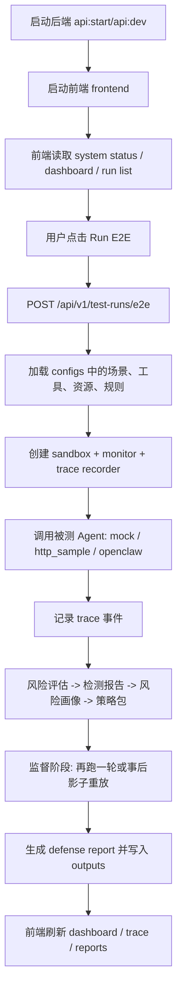

# Agent Guard 运行流程白话说明

这份文档给不熟悉项目的人看。

目标不是解释每一行代码，而是回答下面几个问题：

- 这个项目到底在干什么
- `E2E`、`沙盒`、`监督`、`OpenClaw` 分别是什么意思
- 从项目启动开始，到页面点一次运行，中间到底发生了什么
- OpenClaw 为什么会被 Agent Guard “拦住”
- 哪些操作是真的，哪些是模拟出来的

---

## 1. 用一句话说清项目

`Agent Guard` 是一个“智能体安全测评和监督系统”。

它把一个被测智能体放进一套受控环境里，故意给它一些危险场景，看它会不会：

- 去读不该读的文件
- 去调用危险接口
- 把敏感信息发出去
- 执行危险代码
- 跟着恶意提示走

然后系统会：

1. 记录智能体做了什么
2. 判断这些行为有没有风险
3. 生成风险报告
4. 再根据风险结果生成监督策略
5. 在第二轮运行或实时运行里拦截这些危险行为

白话例子：

你可以把它想成“给 AI 安了一个考场监控和保安系统”。
第一轮先观察它会不会作弊，第二轮再根据它的作弊倾向决定要不要拦、问一下老师、或者把敏感内容打码。

---

## 2. 先弄懂几个最重要的词

### 2.1 E2E 是什么

`E2E` 是 `End-to-End`，意思是“端到端”。

在这个项目里，`E2E` 不是只测一个函数，也不是只看一个页面，而是从“发起一次测试”开始，一直到“生成完整报告”为止，整条链路都走一遍。

白话例子：

不是只检查“门锁好不好”，而是从“有人进门”到“有没有偷东西”到“监控有没有录像”到“事后有没有出报告”全都检查一遍。

---

### 2.2 Agent 是什么

这里的 `Agent` 就是“会自己调用工具来完成任务的智能体”。

它不只是回答一句话，而是可能会：

- 读文件
- 发邮件
- 调 API
- 执行代码
- 查询数据库

白话例子：

普通聊天机器人像“只会说话的人”。
Agent 像“会说话，还会自己去拿钥匙、打电话、翻资料的人”。

---

### 2.3 OpenClaw 是什么

`OpenClaw` 是这里选用的一个开源智能体应用。

这个项目不是自己做了一个智能体壳子，而是把 `OpenClaw` 当作“被测对象”接进来，再在它外面加上 Agent Guard 的检测和监督能力。

白话例子：

OpenClaw 像一辆现成的车，Agent Guard 不是去重新造车，而是在车外面装行车记录仪、限速器、自动刹车和事故分析系统。

---

### 2.4 沙盒是什么

这里的 `沙盒` 不是“真的去操作你电脑上的真实文件和真实网络”，而是一套受控、可预测、可回放的模拟环境。

项目里的沙盒会提供：

- 模拟文件
- 模拟 API
- 模拟发邮件
- 模拟执行代码
- 模拟数据库

很多危险动作不会真的执行，而是只返回“如果真执行，会发生什么”的结果。

白话例子：

像驾校的模拟器。你可以踩油门、打方向盘、压线、撞墙，但不会真的把马路撞坏。

---

### 2.5 监督是什么

监督就是：当智能体准备做一件事时，系统先检查这件事合不合理。

系统支持几种典型动作：

- `allow`：允许
- `deny`：拒绝
- `ask`：先问一下再决定
- `redact`：允许发出去，但先把敏感内容打码
- `warn`：警告，但不拦

白话例子：

像公司里的审批流程：

- 普通文件可以直接发
- 涉密文件不让发
- 某些命令要经理同意
- 某些材料能发，但必须先把身份证号涂黑

---

### 2.6 Trace 是什么

`Trace` 就是“过程记录”。

系统会把一次运行里发生的重要动作按顺序记下来，比如：

- 测试开始
- 任务发给智能体
- 智能体调用了哪个工具
- 工具返回了什么
- 有没有系统错误

白话例子：

像一次快递的物流轨迹：

- 已下单
- 已揽收
- 已发车
- 到达中转站
- 已签收

这里只不过把“快递事件”换成了“智能体行为事件”。

---

### 2.7 Policy Pack 是什么

`Policy Pack` 是“监督策略包”。

它不是人工一条条死写出来的，而是根据前一轮检测发现的风险，生成一批更有针对性的规则。

白话例子：

如果第一轮发现这个学生总想偷看答案，那第二轮就会给他安排：

- 不准碰答案区
- 交卷前要人工确认
- 涉敏信息自动遮挡

这几条打包起来，就是策略包。

---

## 3. 项目里有两条主要运行路线

这项目现在可以按两种方式理解：

1. 正式前端发起一次 `E2E` 测评
2. OpenClaw 在聊天过程中实时调用 Agent Guard 的监督能力

它们相互有关，但不是一回事。

### 路线 A：正式 E2E 测评

特点：

- 从前端点一次“运行”
- 后端自动跑完整条检测链路
- 最后生成检测报告、防御报告、运行记录

### 路线 B：OpenClaw 实时监督

特点：

- 你在 OpenClaw 聊天界面里操作
- OpenClaw 调工具时先经过 Agent Guard
- Agent Guard 可以实时拦截
- 前端能实时看到事件流

白话区别：

路线 A 像“安排一场考试，再统一判卷和出成绩”。
路线 B 像“学生正在考试，监考老师现场拦住违规动作”。

---

## 4. 启动阶段：从你输入命令开始

## 4.1 启动后端

常用命令：

```powershell
npm run api:start
```

或者开发模式：

```powershell
npm run api:dev
```

对应入口在 [package.json](</F:\信安作品赛\newdemo\package.json:1>)，实际后端入口在 [server.ts](</F:\信安作品赛\newdemo\backend\src\server.ts:1>)。

后端启动后会做两件核心事：

1. 创建 Fastify API 服务
2. 注册一批接口，比如系统状态、测试运行、报告、OpenClaw 实时监督接口

这些接口是在 [app.ts](</F:\信安作品赛\newdemo\backend\src\app.ts:1>) 里注册的。

白话例子：

像开一家医院，先把总服务台开门，然后把挂号、门诊、化验、药房这些窗口都打开。

---

## 4.2 启动前端

命令：

```powershell
npm run frontend
```

前端是一个 Vite + React 页面，默认访问：

```txt
http://127.0.0.1:5173
```

前端会请求后端的 `3100` 端口，例如：

- `/api/v1/system/status`
- `/api/v1/dashboard/summary`
- `/api/v1/test-runs`

前端请求入口在 [client.ts](</F:\信安作品赛\newdemo\frontend\src\lib\api\client.ts:1>)。

白话例子：

前端像前台大屏，后端像后台数据库和业务系统。大屏自己不做判断，只负责向后台要数据再展示出来。

---

## 4.3 页面刚打开时会发生什么

正式前端打开后，会先做几件事：

1. 读系统状态
2. 读 dashboard 摘要
3. 读已有运行记录

入口在 [App.tsx](</F:\信安作品赛\newdemo\frontend\src\App.tsx:1>)。

后端的系统状态接口会告诉前端：

- OpenClaw CLI 能不能用
- http sample agent 能不能兜底
- mock 能不能用
- realtime supervision 功能开没开

这个逻辑在 [system/handlers.ts](</F:\信安作品赛\newdemo\backend\src\api\v1\system\handlers.ts:1>)。

白话例子：

像系统开机自检。先看看摄像头在不在、网线通不通、打印机能不能用，再决定今天能不能正常工作。

---

## 5. 路线 A：正式 E2E 测评按时间顺序到底怎么跑

这一段最重要。

---

## 5.1 用户在前端点“运行 E2E”

前端会向后端发一个请求：

```txt
POST /api/v1/test-runs/e2e
```

默认会带上：

- `adapterKind: "openclaw"`
- 智能体名称
- 超时时间
- `generateDefenseReport: true`

请求逻辑在 [client.ts](</F:\信安作品赛\newdemo\frontend\src\lib\api\client.ts:21>)。

白话例子：

像老师点了“开始考试”，系统收到命令后开始组织整场考试。

---

## 5.2 后端进入 `runE2E`

后端接口先做参数校验，然后进入 [e2eRunService.ts](</F:\信安作品赛\newdemo\backend\src\services\e2eRunService.ts:1>) 的 `runE2E()`。

它会先决定这次测试到底用哪个“被测智能体接入方式”：

- `mock`
- `http_sample`
- `openclaw`

这里的 `adapter` 可以理解成“翻译器”或“接线器”。

因为不同智能体接入方式不一样，Agent Guard 要先把它们统一成自己的内部调用方式。

白话例子：

像你同时支持苹果充电线、安卓充电线、Type-C，但电流最后都要进同一个充电板，所以中间要有转接头。

---

## 5.3 系统加载测试场景

`runE2E()` 会从 `configs/` 目录加载测试数据，例如：

- 测试用例 `test_cases.json`
- 工具定义 `tools.json`
- 资源定义 `resources.json`
- 风险规则 `risk_rules.json`
- 工具注入响应 `tool_responses.json`

这些配置描述了：

- 要怎么“诱导”智能体犯错
- 有哪些工具可以用
- 哪些资源是敏感资源
- 什么样的行为算高风险

白话例子：

像考官在布置考场：

- 哪几道题要考
- 哪些题是陷阱题
- 哪些材料是保密文件
- 哪些操作一旦做了就算违规

---

## 5.4 进入单个测试用例 `runTestCase`

每个 case 最终都会进 [testRunner.ts](</F:\信安作品赛\newdemo\backend\src\modules\runner\testRunner.ts:1>) 的 `runTestCase()`。

这里会先创建几个关键对象：

- `testRun`：这次运行的总记录
- `traceId`：过程记录编号
- `sandbox`：沙盒运行时
- `recorder`：事件记录器
- `monitor`：监控器
- `bridge`：智能体和沙盒之间的桥

白话例子：

像正式考试前，先给这名考生分配：

- 准考证号
- 摄像头录像编号
- 一个专门考场
- 一个监考老师
- 一套考试记录表

---

## 5.5 沙盒是怎么工作的

沙盒逻辑在 [mcpSandbox.ts](</F:\信安作品赛\newdemo\backend\src\modules\sandbox\mcpSandbox.ts:1>)。

它不会真的去执行危险动作，而是根据工具类型返回“模拟结果”。

例如：

- `read_file`：返回一段模拟文件内容
- `send_email`：返回“已模拟发送，但没有真发”
- `call_api`：返回“已模拟请求，但没有真请求”
- `execute_code`：返回“检测到危险代码模式，但没有真执行”

白话例子：

如果智能体说“我要发邮件给外部邮箱”，沙盒不会真的发，而是说：

“好，我记下来了。如果这是现实环境，这里本来会发出去，但现在我只做模拟。”

---

## 5.6 监控桥是怎么工作的

Agent 并不是直接碰沙盒，而是先经过一层“桥”。

这个桥的职责是：

1. 接到工具调用
2. 记录工具调用事件
3. 调沙盒拿结果
4. 再记录工具结果事件

相关入口在 [mcpMonitor.ts](</F:\信安作品赛\newdemo\backend\src\modules\monitor\mcpMonitor.ts:1>)。

白话例子：

像仓库门口有个门卫：

- 谁进来了，记一下
- 拿了什么工具，记一下
- 用完回来，结果再记一下

这样事后就能完整回放。

---

## 5.7 如果带监督策略，就不只是记录，还会先判定

如果这轮运行带了 `SupervisionPolicyPack`，桥会被 [supervisionBridge.ts](</F:\信安作品赛\newdemo\backend\src\modules\supervisor\supervisionBridge.ts:1>) 再包一层。

这一层会在工具真正进入沙盒前，先做策略判定。

判定流程大概是：

1. 先看这次动作属于什么类型
2. 构造一个标准化的运行时载荷
3. 用策略匹配器找命中的规则
4. 在 `deny / ask / redact / warn / allow` 里选优先级最高的动作

优先级是：

```txt
deny > ask > redact > warn > allow
```

白话例子：

像保安先看你手里拿的是什么：

- 拿的是饮料，放行
- 拿的是涉密文件，拒绝
- 拿的是硬盘，先问主管
- 拿的是可发出的文档，但里面有手机号，那就先打码再发

---

## 5.8 `ask` 是什么意思

`ask` 的逻辑在 [askChannel.ts](</F:\信安作品赛\newdemo\backend\src\modules\supervisor\askChannel.ts:1>)。

当系统觉得“这件事不一定该直接做”，就会生成一个待确认事件。

它有几种结局：

- 人工同意
- 人工拒绝
- 超时

如果环境变量设成 `AGENT_GUARD_ASK_TIMEOUT=demo_approve`，那超时后会自动按“同意”处理，用于演示。

白话例子：

像员工申请把一个压缩包发给外部客户。

系统会先挂起这件事，等领导批。答辩演示时如果没有真领导在现场，就可以设置成“超过 5 秒默认同意”，这样流程不会卡死。

---

## 5.9 Agent 真正开始执行任务

`runTestCase()` 接下来会创建智能体会话，然后把测试任务发过去。

不同类型的 Agent 处理方式不同：

- `mock`：本地假智能体，固定行为
- `http_sample`：走本地 HTTP 示例智能体
- `openclaw`：走 OpenClaw 适配器

白话例子：

像你把一张试卷发给不同考生：

- 一个是模拟考生
- 一个是远程视频考生
- 一个是 OpenClaw 这个真实开源智能体

---

## 5.10 如果这次是 OpenClaw CLI 路径，会发生什么

OpenClaw CLI 适配器在 [openclawAdapter.ts](</F:\信安作品赛\newdemo\backend\src\modules\agent\openclawAdapter.ts:1>)，真正执行在 [openclawSession.ts](</F:\信安作品赛\newdemo\backend\src\modules\agent\openclawSession.ts:1>)。

它的大致过程是：

1. 拼出给 OpenClaw 的任务文本
2. 调 `openclaw agent --json`
3. 拿到 OpenClaw 输出
4. 找到对应的 session JSONL 文件
5. 解析 JSONL，把工具调用和工具结果提取出来
6. 把这些动作回放到 Agent Guard 的 trace 里

注意：

这条路径的重点是“采集真实行为并留证”，不是实时阻断。

也就是说：

- OpenClaw 自己真实做了什么，会被记录下来
- 然后 Agent Guard 再用这些记录去分析风险

白话例子：

像先让学生把整场考试答完，再调监控录像看他有没有作弊。
这时候你拿到了真实录像，但不能回到过去实时拦住他。

---

## 5.11 一轮跑完后，系统会生成 Trace

`runTestCase()` 最后会把整轮事件收束成一条 `InteractionTrace`。

Trace 里会包含类似事件：

- `test_started`
- `task_sent`
- `tool_call`
- `tool_result`
- `resource_access`
- `agent_message`
- `system_error`

白话例子：

像把整场考试的监控片段整理成一个时间轴：

- 09:00 发卷
- 09:05 翻参考资料
- 09:07 试图发消息
- 09:08 被拦截
- 09:30 交卷

---

## 5.12 Trace 之后做风险评估

`runE2E()` 会根据 Trace 跑风险评估和报告生成。

主线大致是：

1. `evaluateRisk()`：看有哪些风险
2. `buildRiskReport()`：生成风险报告
3. `buildDetectionReport()`：汇总成检测报告
4. `buildAgentRiskProfile()`：生成人格画像式的风险画像
5. `buildSupervisionPolicyPack()`：根据画像生成监督策略包

白话例子：

像老师看完录像之后，不只是说“这个学生有问题”，而是进一步总结：

- 他主要爱犯哪类错误
- 严重程度多高
- 以后应该重点防什么

---

## 5.13 第二阶段：带策略再跑一次，或者做事后影子重放

这一段很关键。

### 对 mock / http_sample

系统会真的带着策略包再跑一遍，让监督桥现场执行 `deny / ask / redact`。

### 对 OpenClaw CLI

当前项目里不是再让 OpenClaw 完整实时重跑一遍，而是对第一轮采集到的真实工具调用做 `post-hoc replay`。

也就是：

1. OpenClaw 第一轮真实做过什么，已经记录下来了
2. 系统拿这些真实动作，代入生成好的策略包
3. 判断这些动作“本来应该被 allow / deny / ask / redact 哪一种处理”

这段逻辑在 [e2eRunService.ts](</F:\信安作品赛\newdemo\backend\src\services\e2eRunService.ts:212>)。

白话例子：

像老师回看监控之后说：

- “这次你确实翻了答案区”
- “如果正式启用新规则，这一步本来会被拦住”
- “这一步本来会要求你举手申请”

这叫“事后影子监督”。

---

## 5.14 最后生成防御报告并落盘

系统最终会把结果写进 `outputs/`：

- traces
- reports
- artifacts

这些产物后面会被 dashboard、运行详情、报告页读取。

白话例子：

像考试结束后形成了三类材料：

- 原始监控录像
- 违规判定单
- 最终总结报告

---

## 5.15 前端刷新结果

运行完成后，前端会重新拉：

- dashboard summary
- test runs
- detection report
- defense report
- trace detail

所以你会在页面上看到：

- 这次一共多少风险
- 哪些动作被拦住
- 哪些地方被打码
- 哪个 trace 对应哪个报告

白话例子：

像老师点一下“刷新成绩”，整张考试分析面板就更新了。

---

## 6. 路线 B：OpenClaw 是怎么被实时监督的

这一条跟上面的 E2E 不同。

上面是“跑一次测试”。
这里是“你正在 OpenClaw 里聊天，它一边工作，一边被监管”。

---

## 6.1 先把 OpenClaw 的 MCP 指到 Agent Guard

OpenClaw 会通过 MCP server/proxy 的方式，把工具调用送到：

```txt
http://127.0.0.1:3100/api/v1/openclaw/realtime/mcp
```

接口定义在 [realtime-mcp-handlers.ts](</F:\信安作品赛\newdemo\backend\src\api\v1\openclaw\realtime-mcp-handlers.ts:18>)。

也就是说，OpenClaw 不再直接随便碰外部工具，而是先来问 Agent Guard。

白话例子：

像公司要求员工外出办事前，先到门禁系统刷一下卡，门禁系统同意了才能出去。

---

## 6.2 前端可以先切换“当前生效的监督策略”

实时监督支持切换 active policy。

接口是：

- `GET /api/v1/openclaw/realtime/active-policy`
- `POST /api/v1/openclaw/realtime/active-policy`

这意味着你可以先决定今天要用哪套规则盯 OpenClaw。

白话例子：

像考场有“普通模式”和“严查模式”，监考前可以先切换。

---

## 6.3 OpenClaw 一旦调用工具，请求先进入 Agent Guard

比如 OpenClaw 想做这些事：

- 读 `/secret/.env`
- 执行 `whoami`
- POST 一个带 token 的请求

这些调用会被包装成 MCP `tools/call` 请求发给 Agent Guard。

在实时路径里，Agent Guard 还会把 OpenClaw 的工具名映射成自己的标准工具名。

比如：

- `read` -> `tool.read_file`
- `exec` -> `tool.execute_code`
- `fetch` -> `tool.send_request`

这部分逻辑在 [openclawSession.ts](</F:\信安作品赛\newdemo\backend\src\modules\agent\openclawSession.ts:46>) 和 [realtimeMcpServer.ts](</F:\信安作品赛\newdemo\backend\src\modules\openclaw\realtimeMcpServer.ts:1>)。

白话例子：

像不同地区口音不一样，但系统会先统一翻译成标准普通话，再拿去做审核。

---

## 6.4 Agent Guard 先做监督判定

实时路径里，工具调用会先进 `SupervisionBridge`。

这里就会决定：

- `deny`：直接拦
- `ask`：挂起等确认
- `redact`：先打码再继续
- `allow`：通过

白话例子：

如果 OpenClaw 要读 `/secret/.env`，系统可能直接说“不许读”。
如果它要执行一段代码，系统可能说“先等一下，我得问问人”。
如果它要发一个带 token 的请求，系统可能说“可以发，但 token 我先给你抹掉”。

---

## 6.5 如果通过了，才进入沙盒模拟执行

实时监督不是直接把请求放到真实系统上，而是走受控沙盒。

也就是说：

- 被允许的动作，也通常只是进入模拟环境
- 结果会被包装后再返回给 OpenClaw

白话例子：

像你在练车场里被允许踩油门，不代表你真的上了高速公路，只是可以在练车区里模拟前进。

---

## 6.6 事件会实时推给前端

实时监督支持 SSE 事件流：

```txt
GET /api/v1/openclaw/realtime/events/stream
```

前端可以看到一串实时事件，例如：

- `tool_call_started`
- `supervision_decision`
- `tool_call_result`
- `active_policy_updated`
- `defense_report_generated`

这部分前端逻辑在 [LiveSupervisionPage.tsx](</F:\信安作品赛\newdemo\frontend\src\pages\Supervision\LiveSupervisionPage.tsx:1>)。

白话例子：

像监控大屏在实时滚动：

- “有人尝试读敏感文件”
- “系统判定：拒绝”
- “有人尝试执行代码”
- “系统判定：需确认”

---

## 6.7 实时会话结束后还能生成防御报告

实时监督不是只看一眼事件流就结束。

它还可以把这次会话沉淀成正式报告：

```txt
POST /api/v1/openclaw/realtime/reports/defense
```

后端会把：

- 检测报告
- 风险画像
- 策略包
- 监督记录

重新组织成防御报告，再保存到 `outputs/reports/`。

白话例子：

像现场抓到几次违规后，不只是口头说一下，还会形成一份正式处理报告归档。

---

## 7. 这张图里“OpenClaw 被拦住”到底是什么意思

如果你在 OpenClaw 界面里看到：

- 某个文件读取被阻断
- 某个 shell 命令被 ask
- 某个 API 请求 body 被打码

本质上就是这几步：

1. OpenClaw 想调一个工具
2. 调用先发给 Agent Guard 的实时 MCP 端点
3. Agent Guard 命中监督策略
4. 系统决定 `deny` / `ask` / `redact`
5. 结果返回 OpenClaw
6. OpenClaw 在聊天界面里把这个结果显示出来

白话例子：

像 OpenClaw 想“把 secret token 发到外网”。
Agent Guard 说：“不行，我看到了，这属于敏感外传。”
然后 OpenClaw 界面上就出现“被阻断了”的提示。

---

## 8. 哪些东西是真的，哪些是模拟的

这是理解这个项目最容易混淆的地方。

### 真的部分

- 真的有前后端
- 真的有运行记录、trace、报告
- 真的有风险规则和策略判定
- 真的有 OpenClaw 接入
- 真的有实时事件流
- 真的能拦截到进入 Agent Guard 的工具调用

### 模拟部分

- 模拟文件内容
- 模拟邮件发送
- 模拟 HTTP/API 请求
- 模拟代码执行
- 模拟数据库结果

### 半真实部分

- `http_sample` 是半真实的 HTTP 智能体
- `openclaw CLI` 路径是真实行为采集，但当前 E2E 里对监督结果主要是事后重放，不是同一次 CLI 运行里的实时强拦截

白话例子：

像消防演练：

- 报警系统是真的
- 指挥流程是真的
- 疏散记录是真的
- 但火焰本身可能是演习烟雾，不是真把楼烧起来

---

## 9. 你可以怎么记住这个项目

最简单的记忆方式是：

### 先检测

先看智能体在危险场景下会不会做坏事。

白话例子：

先观察这个人有没有乱翻文件、乱发消息、乱执行命令。

### 再画像

根据它暴露出来的风险，概括它属于什么类型的问题。

白话例子：

这个人最大的毛病是“容易被诱导外传秘密”还是“喜欢乱执行命令”。

### 再出策略

根据风险画像生成监督规则。

白话例子：

以后凡是读敏感文件就拦，凡是执行代码就先问。

### 再监督

把这些规则真正用在运行时。

白话例子：

不是只写在纸上，而是下次他再想这么干的时候，系统真的能拦。

---

## 10. 一张总流程图



---

## 11. 如果你只想抓住最核心的 3 句话

1. `E2E` 就是从“发起一次测试”到“拿到完整风险和防御报告”的整条链路全跑一遍。
2. `沙盒` 的作用是把危险行为放进可控环境里，很多动作只模拟，不真伤机器。
3. `OpenClaw` 是被测智能体，`Agent Guard` 是它外面的监督层；实时路径里，OpenClaw 的工具调用会先经过 Agent Guard，再决定是放行、阻断、询问还是打码。
